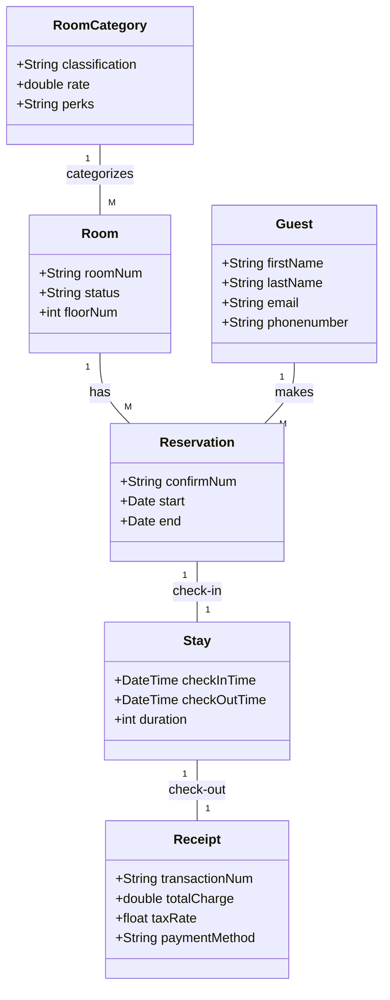
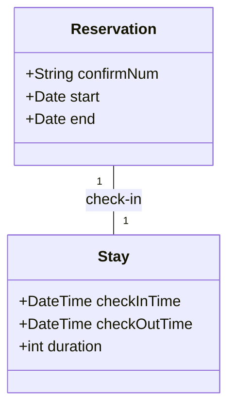
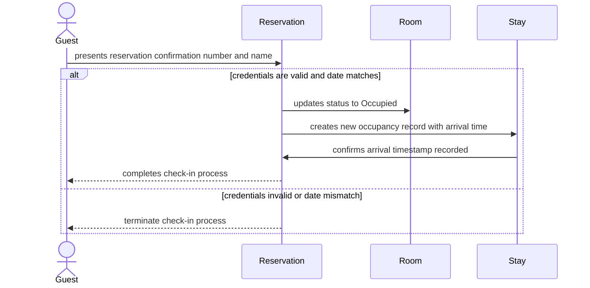

# Na Cha - Assignment 1

## Deliverable 1: Entity Inventory

**Guest** are the individual who can make reservations via calls, emails, or walk-ins. 
- **Attributes:** firstName, lastName, email, phonenumber
- **Rationale:** Unique identity of an individual which has different hotel reservations and transcactions history.

**Room** are the phyiscal units in the hotel which has a reservation status.
- **Attributes:** roomNum, status, floorNum
- **Rationale:** As a room it is a unique identity of being a physical unit in hotel inventory.

**Room Category** are the classification types of the room such as the standard, deluxe, or suite.
- **Attributes:** classification, rate, perks
- **Rationale:** A unique identity of the different tiers of rooms which is independant of room status.

**Reservation** are a type of booking record/contract for a guest such as the booked dates and status of the room.
- **Attributes:** confirmNum, start, end
- **Rationale:** Unique identtiy of a contract between a guest and the system.

**Stay** is the tracking of the check-in/check-out status when a guest has checked into a reservation for a room.
- **Attributes:** checkInTime, checkOutTime, duration
- **Rationale:** Unique and distinct identity of the time the guests occupied stays' reservation.

**Receipt** is a paper that is a recorded total charge for a guest's confirmed reservation at check-out.
- **Attributes:** transactionNum, totalCharge, taxRate, paymentMethod
- **Rationale:** A unique identity of being a financial record of a fulfilled contract between the guest and the system which is then transaction history.

---

## Deliverable 2: Domain Model Diagram

---

## Deliverable 3: Detailed Use Case

**Precondition:** There is a valid reservation that exists in the system with a matching start and current date that was reserved by the guest three weeks prior.

**Main Flow:**

| Actor | System |
| --- | --- |
| (1) Guest checks in to their reservation with reservation number and name | |
| | (2) System checks reservation confirmation number and check-in start date and matches with current date |
| | (3) if confirmation number does not link guest to the reservation, terminate |
| | (4) if check-in date matches current date then proceed |
| | (5) if check-in date does not match, guest cannot check-in, process terminated |
| | (6) if room status is available then proceed |
| (7) Guest successfully check-ins to their reservation | |
| | (8) System updates room status to occupied, and a Stay record beginning with check-in time |

**Alternative Flow 1 at Step 1:**
| Actor | System |
| -- | -- |
| (1a) Guest gives only name | |
| | (2a) System checks name with expecting guests arriving on the day's reservation list |

**Alternative Flow 2 at Step 6:**
| Actor | System |
| -- | -- |
| | (6a) System checks room status, if it is not ready and has maintenance status flag, proceed to 7a if there is an empty unclaimed room with same or better classification to move guest's reservation to |
| (7a) Guest successfully check-ins to an reassigned room | |
| | (8a) System updates new room status as occupied with a new stay record beginning with the check-in time |

**Postcondition:**
Guest check-ins to a reserved room, and reservation is now a Stay and the room's status is changed to occupied with room billing rate beginning.

---

## Deliverable 4: Specification and Instance

There are two notable concepts, Reservation and Stay. Reservation knows the guest's intended check-in date and check-out date. Whereas Stay knows the real, actual time the guest arrives to check-in and check-out, as well as the duration of the actual stay.

To describe a specific thing or scenario at the Harborview Inn, such as, "I heard that Bob was supposed to arrive on Moneday at 10:00 AM to check-in for his Deluxe room, but he ate too many hamburgers and went to the ICU. Well, he did arrive on Tuesday at 7:30 AM to check-in." With such a scenario, there is a Stay record, but it is only when Bob came back on Tuesday after recovering from the ICU. And since these two are separated from each other by being their own unique entity, the reservation still applies.

But, if these two concepts, Reservation and Stay, weren't separated and were a single entity, data corruption or confusion could happen. The model would fail and no longer be able to correctly answer queries such as how long Bob actually checked-in and stayed in the hotel before checking-out.

---

## Deliverable 5: Sequence Diagram

The sequence diagram forced me to decide that Reservation entity is ultimately going to be the entity responsible for most of the main flow's functions. The Reservation object is responsible for knowing if a room is free on a reserved date range. Because the system has to ultimately check and update room status through it at some point. The drawing did reveal that I did not have a proper participant/object that served as the check-in point, such as a staff or manager/owner of the hotel. I had instead gave the responsibility to Reservation to transition to Stay.

---