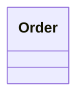

# Markdown Cheat Sheet
## ICS372 — Object-Oriented Analysis, Design and Implementation

Every graded file in this course is a `.md` file. Not `.docx`. Not `.pdf`. Not a screenshot. This isn't a style preference — it's how the grading scripts find your work, how GitHub renders your diagrams, and how your group can actually diff and merge each other's changes. A Word document or an exported PDF in place of a required `.md` file is treated the same as a missing file: zero credit.

This sheet covers the markdown you'll actually use. It is not a complete markdown reference — just what shows up in sketches, design logs, and group artifacts.

---

## 1. The Hard Rule: Everything Is Markdown

**Required file extension:** `.md`, always. Every individual sketch, every design log, every group artifact.

**Diagrams live inside the `.md` file** as fenced Mermaid code blocks — not as attached `.png` files, not as pasted screenshots, not as a separate `.mmd` file linked from the markdown. See the [Mermaid Diagram Cheat Sheet](mermaid-cheatsheet.md) for diagram syntax.

**Why this matters, concretely:**
- GitHub renders markdown and Mermaid diagrams directly in the browser — no download required. A screenshot or PDF can't be reviewed the same way, and can't be graded by the scripts that check your repo structure.
- A `.docx` file doesn't diff cleanly in Git. Your groupmates can't see what changed between commits the way they can with a text-based `.md` file.
- If your diagram is an exported image, nobody — including you, next week — can edit it without redrawing it from scratch. A Mermaid code block is just text; anyone can open it and change one line.

**What this looks like in practice:**

| Instead of... | Do this |
|---|---|
| `design-log.docx` | `design-log.md` |
| A screenshot of a diagram pasted into a Google Doc, exported as PDF | A ` ```mermaid ` code block inside your `.md` file |
| `sketch.png` (an exported image of a hand-drawn or tool-drawn diagram) | The diagram redrawn in Mermaid syntax, in the `.md` file |
| Copy-pasting into Word for "nicer formatting" | Markdown headings, bold, and lists — see below, they render fine on GitHub |

---

## 2. Headings

```markdown
# Biggest heading — use once, for the document title
## Section heading
### Subsection heading
```

Every individual sketch and design log should open with a level-1 or level-2 heading containing **your name, the week, and the date**. This is not optional — see the [ICS 372-02 — Individual Repository](individual-repo-README.md) for what a missing name costs you.

```markdown
# Design Log — Week 6
**Priya Nair · October 1, 2026**
```

---

## 3. Emphasis

```markdown
*italic text*
**bold text**
***bold italic***
`inline code` — use this for class names, method names, field names
```

Rendered:
*italic text*, **bold text**, `OrderQueue.addOrder()`

Use backtick inline code for anything that's literally code: class names (`` `MenuItem` ``), method calls (`` `getPrice()` ``), field names (`` `status` ``). Don't bold these instead — inline code is the correct semantic tag and it's what makes technical writing scannable.

---

## 4. Lists

**Unordered:**
```markdown
- First point
- Second point
  - Nested point (two-space indent)
- Third point
```

**Ordered:**
```markdown
1. First step
2. Second step
3. Third step
```

Use ordered lists for anything sequential — a use case's main flow, steps in an algorithm. Use unordered lists for anything that isn't ordered — entity lists, considerations, open questions.

---

## 5. Code Blocks

Fenced with three backticks. Specify a language after the opening fence for syntax highlighting.

````markdown
```java
public class Order {
    private List<Item> items;
    public void addItem(Item item) { ... }
}
```
````

For Mermaid diagrams specifically, the word immediately after the opening fence must be `mermaid` — this is what tells GitHub to render it as a diagram instead of displaying it as plain code text.

````markdown

````

If you forget the word `mermaid`, GitHub will show your diagram as a gray code block instead of rendering it. Always preview your file before committing — see Section 7.

---

## 6. Tables

```markdown
| Field | Type | Notes |
|---|---|---|
| status | OrderStatus | enum: DRAFT, SUBMITTED, COMPLETE |
| items | List<Item> | never null, may be empty |
```

Renders as:

| Field | Type | Notes |
|---|---|---|
| status | OrderStatus | enum: DRAFT, SUBMITTED, COMPLETE |
| items | List\<Item\> | never null, may be empty |

The header row and the `---` separator row are both required. Column widths in the source don't need to line up — GitHub renders based on the `|` characters, not visual alignment.

---

## 7. Before You Commit: Preview It

A markdown file that looks fine in a plain text editor can still render wrong on GitHub — a missing blank line before a list, a code fence with no language tag, a Mermaid block that's almost-but-not-quite valid syntax.

**Check your rendering before you commit:**
- **VS Code:** `Cmd/Ctrl+Shift+V` opens a markdown preview pane. Install the Mermaid Preview extension to see diagrams render too.
- **Obsidian:** renders markdown and Mermaid natively as you type.
- **GitHub itself:** once pushed, open the file on github.com — if the diagram doesn't render, or your table looks broken, fix it and push again before the deadline. "It looked fine on my computer" is not a defense if it doesn't render on GitHub, because GitHub's renderer is the one that matters.

A Mermaid diagram that fails to render is graded the same as a missing diagram.

---

## 8. Common Mistakes

**Missing blank line before a list**
```markdown
Here are the entities:
- Order
- MenuItem
```
This can render wrong without a blank line between the paragraph and the list. Always put a blank line before (and after) a list, table, or code block.

**Wrong fence language for Mermaid**
````markdown
```
classDiagram
  class Order
```
````
No `mermaid` after the fence — this renders as plain text, not a diagram. Always: ` ```mermaid `.

**Headings with no space after `#`**
```markdown
#Design Log       ← wrong, renders as plain text
# Design Log       ← correct
```

**Using Word-style formatting habits that don't exist in markdown**
There's no underline, no font-size control, no colored text in plain markdown. Don't fight the format — bold, italics, headings, and code blocks cover everything you need for this course.

---

## 9. Putting It in Your Repository

Every individual sketch, design log, and group artifact is a `.md` file, in the correct folder, with the correct name — see the [ICS 372-02 — Individual Repository](individual-repo-README.md) and [ICS 372-02 — Brew & Bite Group Repository](group-repo-README.md) for exact paths.

```
week-06/
    individual-sketch-1.md
    individual-sketch-2.md
    design-log.md
```

No `.docx`. No `.pdf`. No exported images of your diagrams. If it isn't a `.md` file with your Mermaid diagrams embedded as code blocks, it isn't done.
