# Mermaid Diagram Cheat Sheet
## ICS372 — Object-Oriented Analysis, Design and Implementation

All diagrams go in a fenced code block in your markdown file:

````markdown
```mermaid
<diagram type>
  <diagram content>
```
````

---

## 1. Class Diagrams

### Basic syntax

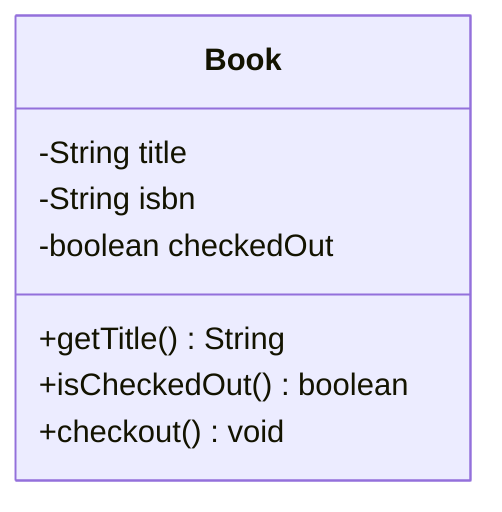

### Access modifiers

| Symbol | Meaning |
|---|---|
| `+` | public |
| `-` | private |
| `#` | protected |
| `~` | package |

### Field and method syntax

```
-fieldName : Type
+methodName(paramName : Type) ReturnType
+methodName() void
```

### Relationships

#### Association — "uses a"
A `Member` has a reference to zero or more `Book` objects.

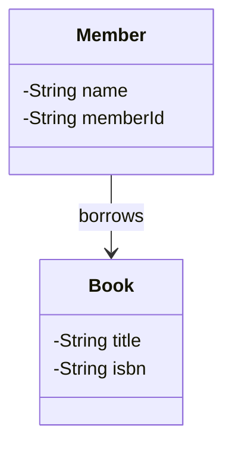

#### Multiplicity on associations

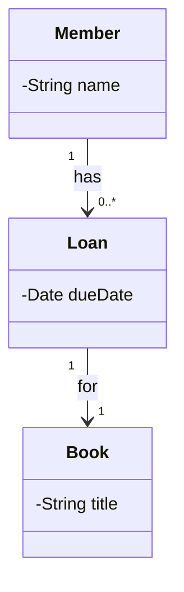

| Notation | Meaning |
|---|---|
| `1` | exactly one |
| `0..1` | zero or one |
| `0..*` or `*` | zero or more |
| `1..*` | one or more |
| `2..5` | between two and five |

#### Inheritance — "is a"
`PhysicalBook` and `EBook` are both types of `Book`.

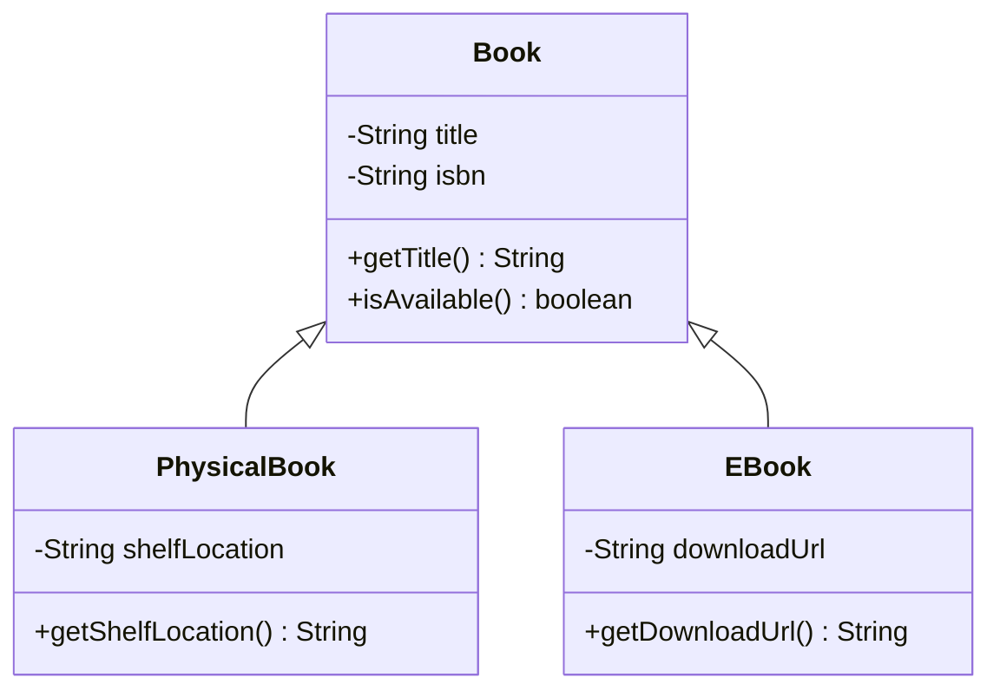

#### Interface implementation — "can act as"

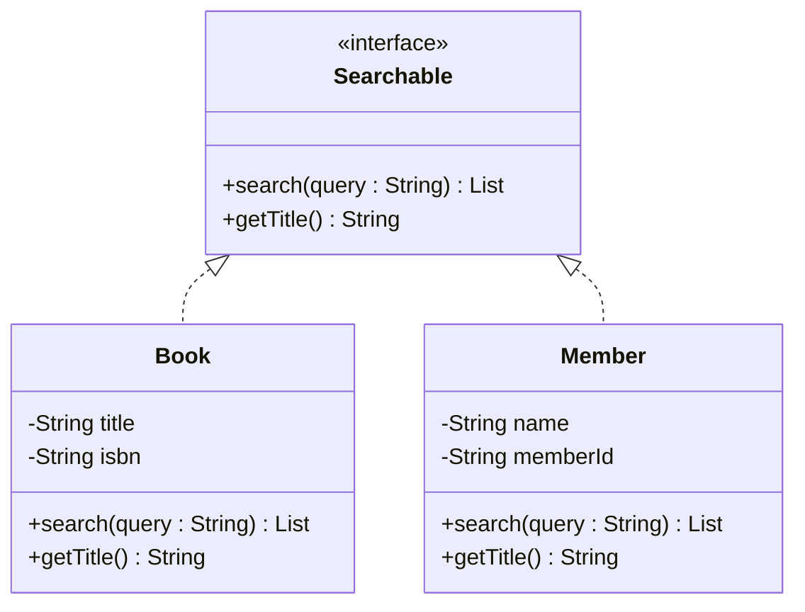

#### Composition — "owns a" (part cannot exist without the whole)
A `Library` owns its `Catalog`. If the library is destroyed, the catalog is too.

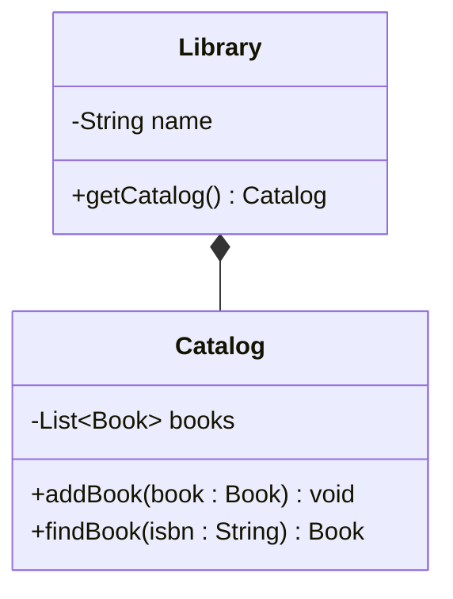

#### Aggregation — "has a" (part can exist independently)
A `Catalog` contains `Book` objects, but books exist independently.

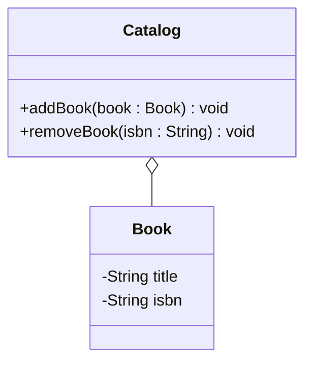

### Relationship symbols summary

| Symbol | Relationship | Read as |
|---|---|---|
| `<|--` | Inheritance | "extends" |
| `<|..` | Implementation | "implements" |
| `-->` | Association | "uses a" / "has a reference to" |
| `*--` | Composition | "owns a" |
| `o--` | Aggregation | "has a" |

### Abstract classes and interfaces

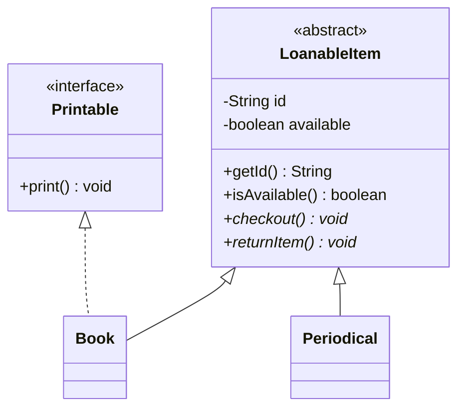

---

## 2. Use Case Diagrams

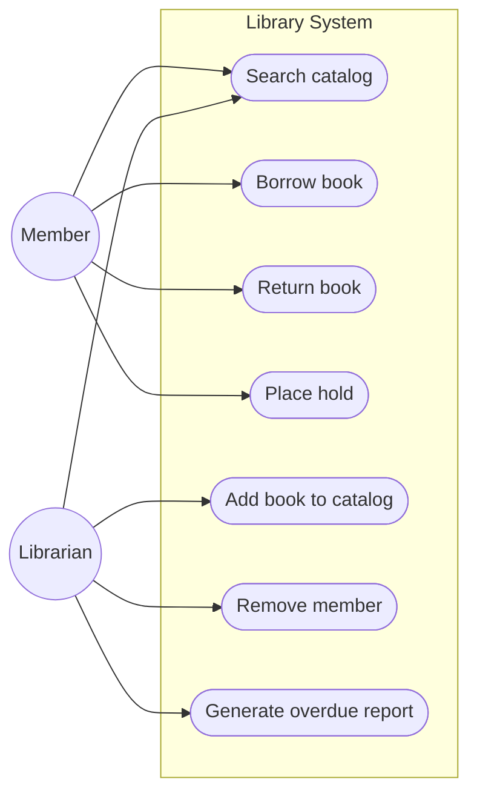

**Notes:**
- Actors are outside the system boundary box
- Use cases are inside
- Use `((ActorName))` for actors
- Use `([Use Case Name])` for use cases
- System boundary is the `subgraph` block

---

## 3. Sequence Diagrams

### Basic message passing

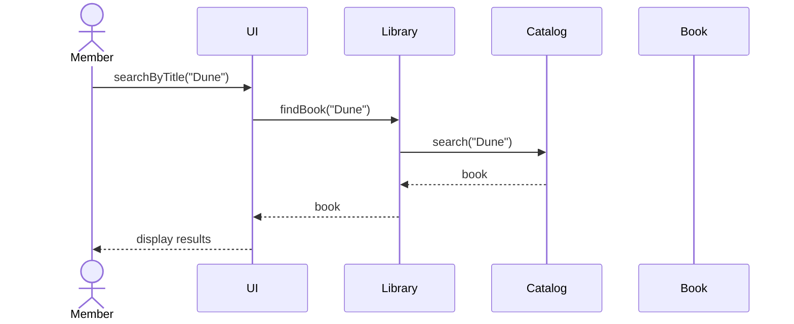

**Arrow types:**

| Arrow | Meaning |
|---|---|
| `->>` | Synchronous message (call) |
| `-->>` | Return / response |
| `-x` | Message that fails |
| `-)` | Asynchronous message |

### Activation bars
Show when an object is actively processing.

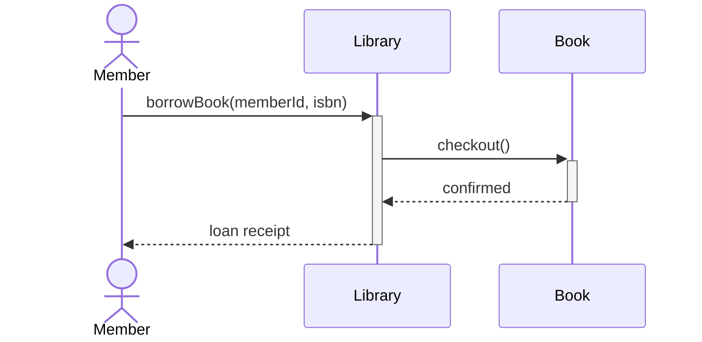

Use `+` before the participant to activate, `-` to deactivate.

### Conditional — alt/else

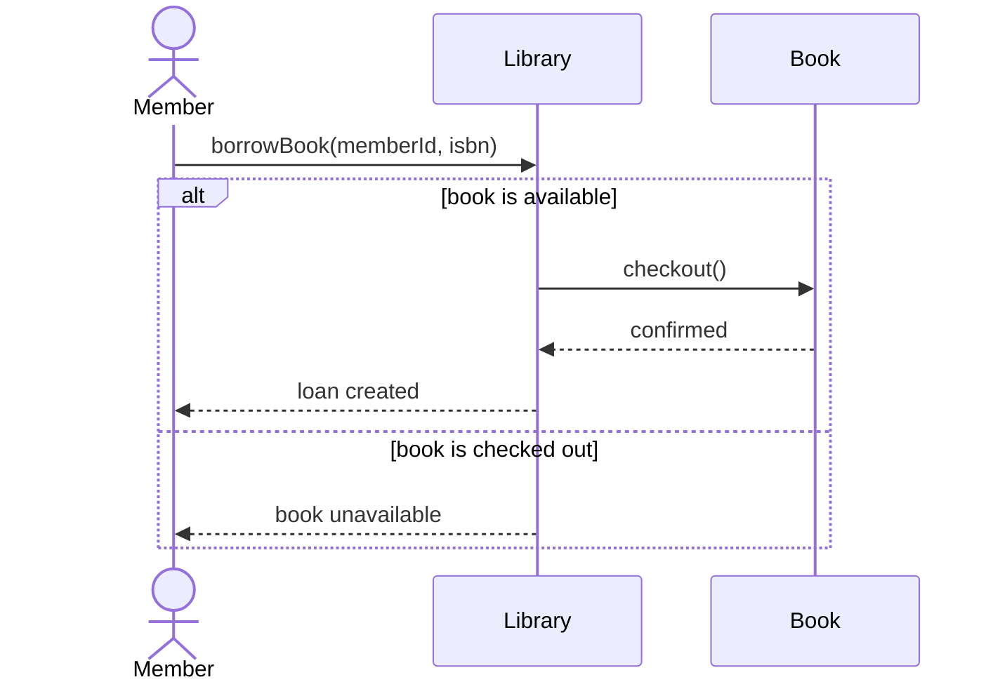

### Optional block — opt

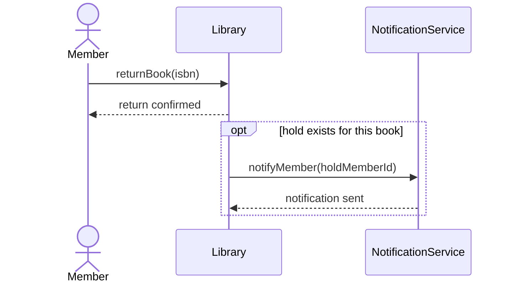

### Loop

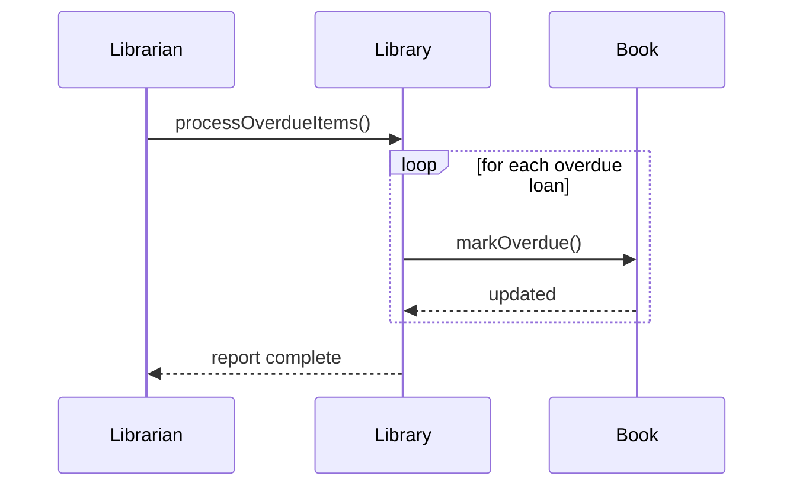

### Combining fragments

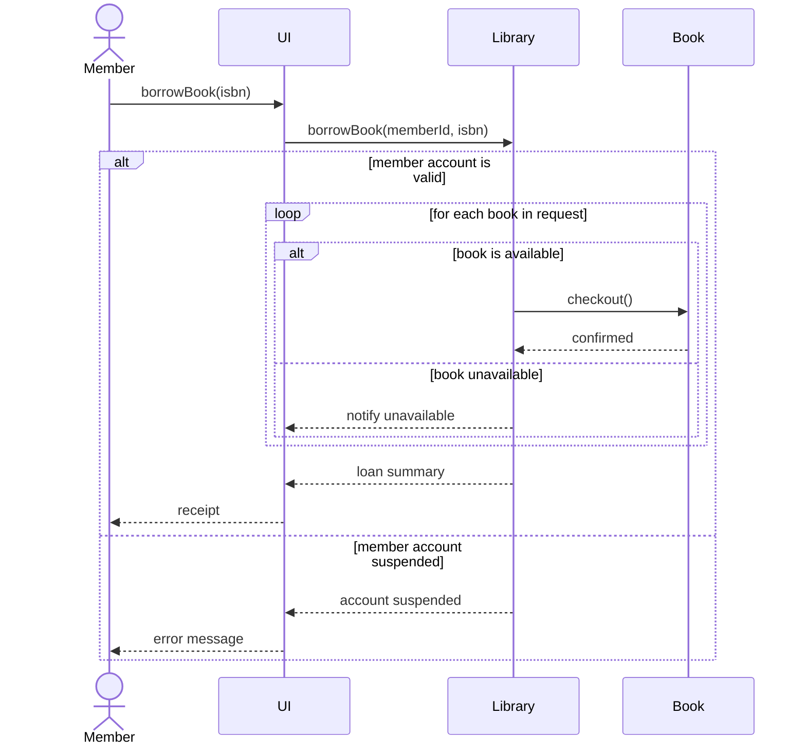

---

## 4. Common Mistakes

**Class diagram: arrow direction**
Arrows point from the dependent class to the class it depends on.
`Member --> Book` means Member depends on Book (Member has a reference to Book).
Not the other way around.

**Class diagram: inheritance vs implementation**
`<|--` is for `extends` (class to class).
`<|..` is for `implements` (class to interface). The dotted line is the hint — interfaces are dotted in UML.

**Multiplicity placement**
Multiplicity goes next to the class it describes.
`Member "1" --> "0..*" Loan` means one Member has zero or more Loans.
Read it left to right: one member, zero-to-many loans.

**Sequence diagram: return arrows**
A return arrow (`-->>`) is not optional. If a method returns something, show it.
If it returns void, you can omit it — but be consistent.

**Sequence diagram: participants vs actors**
Use `actor` for humans interacting with the system.
Use `participant` for objects and classes inside the system.

---

## 5. Putting It in Your Repository

Save your diagram as a `.md` file and commit it:

```
week-02-round-1-domain-model.md
```

Inside the file:

````markdown
# Domain Model — Week 2 Round 1

```mermaid
classDiagram
  ...
```
````

GitHub renders Mermaid diagrams automatically in markdown files.
You do not need to export images.
````
