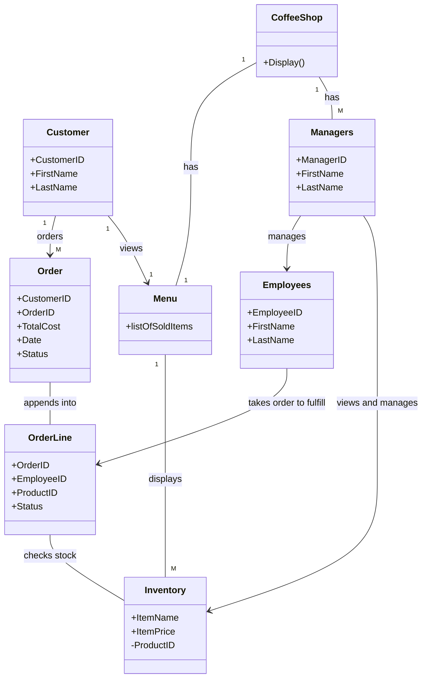

# Individual Sketch — Week 2 Round 1
**Student:** Na Cha
**Date:** 9/3/2026

---

## My Answer

Menus should have access view to inventory.

Customers should have menu access and ability to order.

Employees should have access to order fulfillment.

Managers should have access to change menu and update inventory.

---

## Diagram

---

## What I'm Not Sure About

I think the core systems of this coffee shop point-of-sale system is that it has entites for menus, customers, managers & employees, orders, and inventory but there could be some others as well. Ideally I think, that the customers should also be able to see the quantity in the inventory before placing an order.

---

**Commit this file before group discussion begins.**
