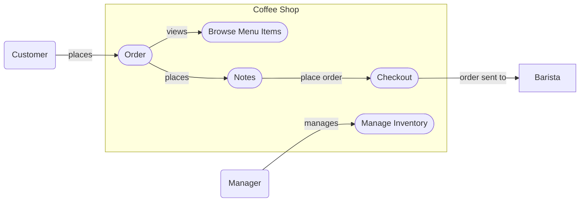

# Individual Sketch — Week 3 Round 2
**Student:** Na Cha
**Date:** 9/10/2026

---

## My Answer

Customer can see menu inventory and cost (2.1). 

Customer can build an order by adding items as well as choose options for size, and extras like milk and syrup (2.2). 

Customer can order more than one of the same drink (2.3). 

Customer can change their mind about an item before the order is placed (2.4).

Customer gets a confirmation order number (2.5). 

Customer can add notes to an order for stuff like temperature or lid (2.6).

Customer can change or adjust their order if there is a mistake (2.7). 

Customers with loyalty membership gets discount automatically (2.8). 

Should be everything the customer needs for this. Found in the earlier paper givne to us.

---

## Diagram

---

## What I'm Not Sure About

I'm not sure about whether or not there should be more interactions listed since most of them are the same or under the same topic.

---

**Commit this file before group discussion begins.**
