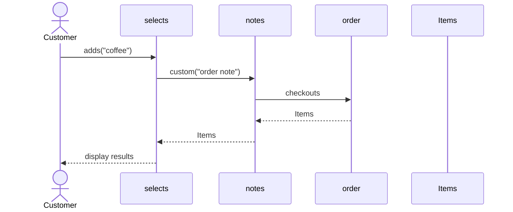
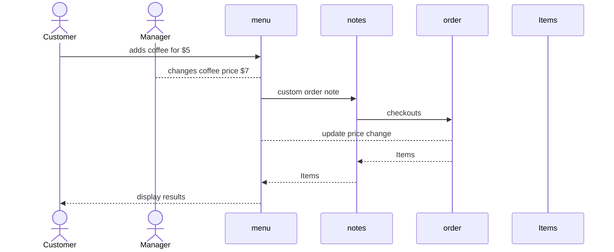

# Individual Sketch — Week 4 Round 2
**Student:** Na Cha
**Date:** 9/17/2026

---

## 1. Tonight's Prompt

Working alone, against your group's docs/design/domain-model.md:

1. Draw Customer Places Order as a sequence diagram in Mermaid, working from the numbered steps of the use case you just wrote. The actor, at least three entities named exactly as your model names them, every arrow labelled with the message in plain language — askForCurrentPrice, not getPrice() — and the return path, not just the outgoing calls.

2. Then draw the price change. Two short diagrams or one, your choice: the manager changing the price, and Sam's order being totalled. Follow the arrow that reads the price and say exactly which object it lands on.

3. State what your model says Sam paid, honestly. If it charges him five dollars, write that down. If you cannot tell, write that down — being unable to tell is itself the answer.

As customer, Sam, adds coffee for $5, the manager changes coffee item on the menu to $7, thus making Sam's coffee cost $7.

---

## 2. What I'm Not Sure About

The sequence diagram was made, however, I am unsure if I should've added more participants in the sequence, and to account for price change and manager.

---

**Commit this file before group discussion begins.**
