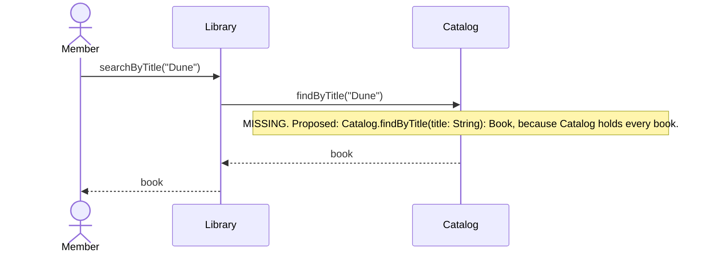
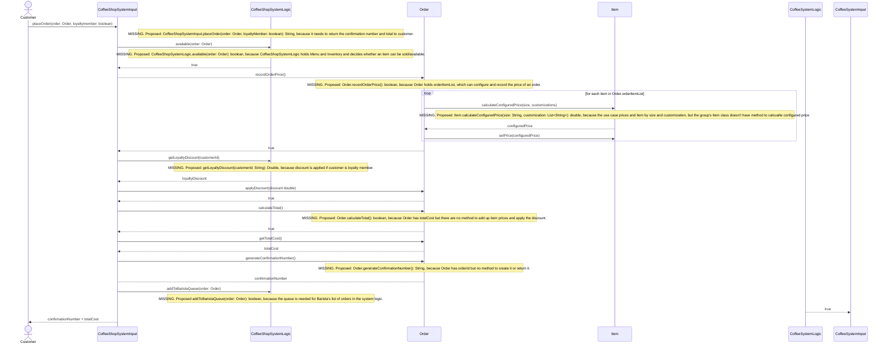

# Individual Sketch Week 7
**Student:** Na Cha
**Date:** 10/8/2026

## Checklist

Check every box before you commit. **10 points.**

- [ ] One Mermaid sequence diagram for the **main flow** of your use case, under step 1 **(4 pts)**
- [ ] Every solid arrow is a method that's already in your class diagram, **or** has a `MISSING` note directly under it **(3 pts)**
- [ ] The diagram renders on GitHub **(1 pt)**
- [ ] Section 2 of the template says what you're least sure of **(2 pts)**
- [ ] Committed to `week-07/individual-sketch.md` **(required: nothing is graded without it)**

---

## 1. Tonight's Prompt

**Step 1: The sequence diagram.** One Mermaid `sequenceDiagram` for the **main flow** of your use case. Leave the alternative flows out. Every arrow follows these rules:

1. The actor is an `actor`. Every class is a `participant`, named exactly as it is in your class diagram.
2. The actor's first arrow goes to the class in your model that should receive the request.
3. Every solid arrow (`->>`) is a method call, labeled `methodName(arguments)`. **The method must already exist on the class the arrow points to**, in your class diagram.
4. **A class can only call a class it's connected to by a line in your class diagram.**
5. Every method that returns something gets a dashed return arrow (`-->>`) labeled with what comes back.
6. When rule 3 or rule 4 fails, draw the arrow you need anyway and put a `MISSING` note directly under it: the method you propose, with its full signature, and why that class.

---

## 2. What I'm Not Sure About

I am not sure for: "CoffeeShopSystemInput ->> CoffeeShopSystemLogic: available(order: Order)" because I think while it is helpful to have the method, the order themselves should already be checked by CoffeeShopSystemLogic because it has access to Menu and Inventory.

---

**Commit this file before group discussion begins.**